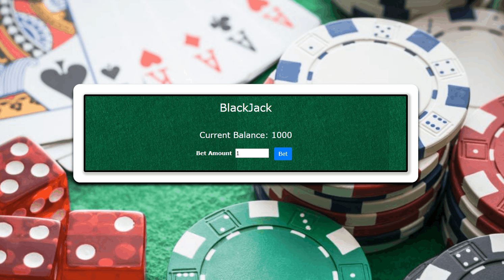
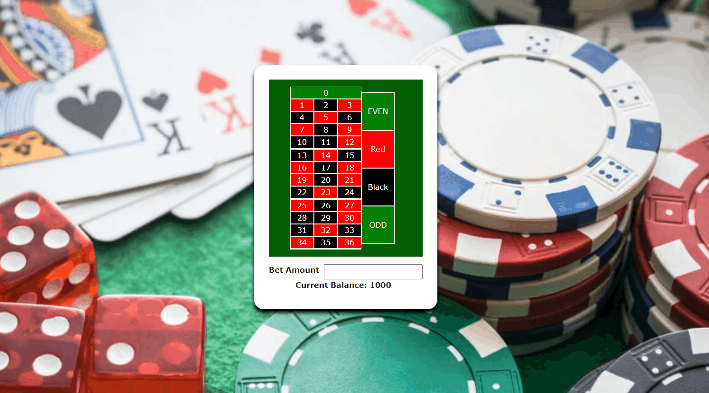

# Gambit

An application for users to register and play online gambling games including Blackjack, Roulette, and Slots.

## Overview

I built this application as a personal project to learn and develop in the MERN stack.

MERN:
- M: MongoDB
- E: Express.js
- R: ReactJS
- N: Node.js

### What I Learned:
- Coding applications in JavaScript.
- Understanding of some of the modern day web technologies.
- Creating a fullstack web application.
- Important security practices including hashing and tokens.

### Future Improvements:
- Clean up the CSS files into one global file.
- Create more universal React components.
- Take a mobile first approach to design.

## Installation

To install and test out my application perform the following steps:

```
git clone https://github.com/djain106/gambit
cd gambit 
npm install
npm start
```
## BlackJack


## Roulette


(Note: Backend of this application is linked with another [github repository](https://github.com/djain106/gambit-backend))
